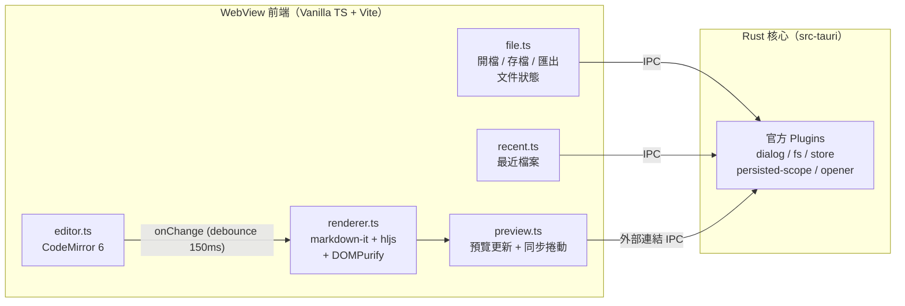

# Plume 🪶

輕量 Markdown 編輯器——左邊寫、右邊即時看渲染結果。Tauri 2 桌面應用，開了就能寫，存了就能走。支援 GFM（表格、任務清單、刪除線）與程式碼語法高亮，可開啟/儲存本機 `.md` 檔、匯出 HTML。為日常筆記、長文寫作與技術文件預覽而生。

## 系統架構



**設計原則**：Markdown 渲染管線完整留在前端（同步、零 IPC、零 race condition）；Rust 端只負責檔案 I/O、對話框與系統整合——這是 Tauri 相對 Electron 的記憶體優勢來源，也避免把解析搬到 Rust 反而被 IPC 序列化成本吃掉的陷阱。

## 技術棧

| 技術 | 版本 | 用途 |
|------|------|------|
| Tauri | 2.x | 桌面應用框架（Rust shell + 系統 WebView） |
| TypeScript + Vite | TS 5.x / Vite（隨 create-tauri-app） | 前端語言與建置工具，零 UI 框架 |
| CodeMirror | 6（`codemirror` meta 套件 + `@codemirror/lang-markdown`） | 編輯器：行號、Markdown 語法高亮、搜尋取代、IME 支援 |
| markdown-it | 14.x | Markdown → HTML（GFM：表格/刪除線內建，linkify 開啟） |
| markdown-it-task-lists | 2.x | GFM 任務清單 checkbox |
| highlight.js | 11.x | 程式碼區塊語法上色（僅註冊常用語言子集） |
| DOMPurify | 3.x | 渲染輸出 XSS 消毒（必備，見 SPEC 安全章節） |
| Tauri Plugins | 2.x | dialog / fs / store / persisted-scope / opener |
| Vitest | 3.x | 單元測試（渲染管線為主） |

## 安裝指引

### 前置需求

- macOS 13+（開發機已驗證：rustc 1.88 / Node 22 / Xcode CLT）
- Rust toolchain（`rustup`）
- Node.js 22+ 與 npm

### 開發

```bash
git clone <repo-url> && cd markdown-tool
npm install
npm run tauri dev     # 啟動開發視窗（含熱更新）
```

### 建置

```bash
npm run tauri build   # 產出 .app 於 src-tauri/target/release/bundle/
```

### 測試

```bash
npm run test          # Vitest 單元測試
```

## 專案結構

```
markdown-tool/
├── index.html              # 版面骨架：工具列 + 左右分割
├── src/                    # 前端（Vanilla TS）
│   ├── main.ts             # 進入點：模組組裝、快捷鍵註冊
│   ├── editor.ts           # CodeMirror 6 封裝
│   ├── renderer.ts         # markdown-it + hljs + DOMPurify 渲染管線
│   ├── preview.ts          # 預覽區更新、同步捲動、外部連結攔截
│   ├── file.ts             # 開檔/存檔/另存/匯出 HTML、文件狀態（路徑、dirty）
│   ├── recent.ts           # 最近開啟檔案（plugin-store）
│   └── style.css           # 版面 + 預覽 typography
├── src-tauri/              # Rust 核心
│   ├── src/lib.rs          # Tauri 啟動 + plugin 註冊
│   ├── capabilities/       # IPC 權限宣告（最小化原則）
│   └── tauri.conf.json     # 視窗、CSP、bundle 設定
├── tests/                  # Vitest 測試
└── docs/                   # 規格文件
    ├── PRD.md              # 需求與使用者故事
    ├── SPEC.md             # 架構、模組職責、IPC 邊界、安全
    └── PLAN.md             # 實作路線圖與冒煙清單
```
